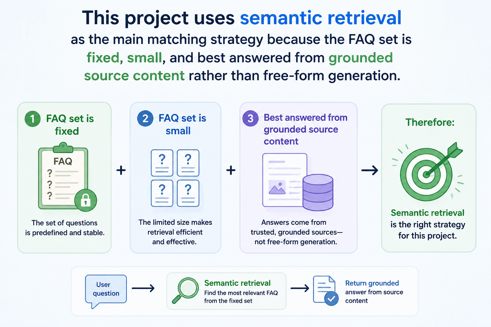
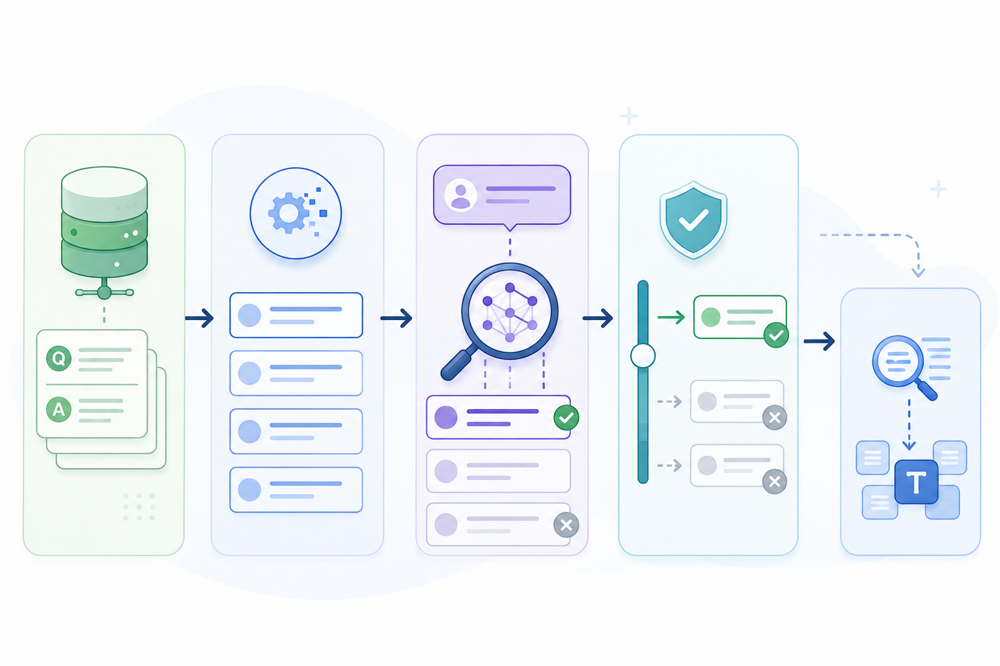

# Riverside Books Chatbot

An AI-powered FAQ chatbot for a fictional independent bookshop, split into a static web frontend, an AWS-ready backend, a local CLI/TUI experience, and a set of project explainer materials.

This `README.md` is the main hub for the repository. Every other README links back here and then fans out into one part of the project in more detail.

## Repository map

- [Vercel-deployed-frontend/README.md](Vercel-deployed-frontend/README.md): static storefront shell plus chatbot widget
- [AWS-deployed-backend/README.md](AWS-deployed-backend/README.md): deployment-facing backend structure and API contract
- [AWS-deployed-backend/app/README.md](AWS-deployed-backend/app/README.md): matcher and data-loading internals
- [Riverside-books-CLI/README.md](Riverside-books-CLI/README.md): local CLI and Textual TUI experience
- [Project-explained/README.md](Project-explained/README.md): analysis layer for decisions, notebooks, and tests
- [Project-explained/Data and requirements/README.md](Project-explained/Data%20and%20requirements/README.md): dataset and dependency notes
- [Project-explained/Notebooks/README.md](Project-explained/Notebooks/README.md): exploratory notebooks
- [Project-explained/tests/README.md](Project-explained/tests/README.md): test coverage and test entrypoints
- [assets/README.md](assets/README.md): media used by this root README

## Demos

### CLI

<p align="center">
  
</p>

### Frontend website

<p align="center">
  
</p>

[Source video](assets/demo-frontend.mp4)

Live frontend: <https://riverside-chatbot-website.vercel.app>

## Quick start

Start with the CLI/TUI if you want the fastest local run. The frontend and AWS backend are documented separately because they have different runtime assumptions.

1. Clone the repo:

```powershell
git clone --branch main https://github.com/Micha12344f/Riverside-chatbot.git
```

2. Move into the TUI folder:

```powershell
cd Riverside-chatbot
cd Riverside-books-CLI
```

Install dependencies and run the TUI.

**Windows:**

4.
```powershell
pip install -r requirements.txt
```
5.
```
python main.py
```

**macOS**

4.
```bash
pip3 install -r requirements.txt
```
5.
```
python3 main.py
```

**Linux**

4.
```bash
pip3 install -r requirements.txt
```
5.
```
python3 main.py
```
Review the component docs as needed:

- frontend: [Vercel-deployed-frontend/README.md](Vercel-deployed-frontend/README.md)
- backend: [AWS-deployed-backend/README.md](AWS-deployed-backend/README.md)
- matcher internals: [AWS-deployed-backend/app/README.md](AWS-deployed-backend/app/README.md)
- project explainer: [Project-explained/README.md](Project-explained/README.md)

> **Note**
> If `pip` is unavailable, install Python first:
> - Windows: [python.org](https://www.python.org/downloads/) or `winget install Python.Python.3.11`
> - macOS: `brew install python`
> - Linux: `sudo apt install python3-pip`

## Security

- Frontend-to-backend traffic should go through the Vercel-side `/api/chat` proxy, with the upstream URL stored in the `RIVERSIDE_BACKEND_URL` Vercel environment variable.
- The Lambda now expects origin-based CORS control through `ALLOWED_ORIGINS` instead of wildcard browser access.
- Public docs in this repo use placeholders for deploy-time infrastructure values rather than live service identifiers.

## Why this approach was chosen



This project uses semantic retrieval as the main matching strategy because the FAQ set is fixed, small, and best answered from grounded source content rather than free-form generation.

That gives a strong balance of quality and control:

- better paraphrase handling than keyword-only matching
- far lower hallucination risk than an LLM-first chatbot
- lower operational cost than calling a model for every question
- easier testing and clearer failure behavior

For more detail, see [Project-explained/README.md](Project-explained/README.md).

## How matching works



The runtime flow is intentionally simple:

1. Load FAQ data from the runtime assets.
2. Turn each FAQ into a searchable document that combines question and answer text.
3. Compare the user query against the FAQ set with semantic similarity.
4. Reject low-confidence or ambiguous matches.
5. Fall back to a lexical matcher if the embedding path is unavailable.

See [AWS-deployed-backend/app/README.md](AWS-deployed-backend/app/README.md) for the code-level explanation and [Project-explained/README.md](Project-explained/README.md) for the reasoning layer.

## Trade-offs

| Approach | Accuracy | Latency | Cost | Hallucination |
| --- | --- | --- | --- | --- |
| LLM as the chat engine | High | Medium-High | High | High |
| Embeddings / semantic matching | Medium-High | Medium | Low-Medium | Low |
| Keyword overlap / fuzzy matching | Low-Medium | Low | Low | Very low |

For this project, semantic matching is the best fit because it handles paraphrased questions well without paying the cost and hallucination risk of an LLM-first design.

## What comes next for scale


The next step after the current demo architecture is migrating from a static, hand-curated FAQ JSON file to a LangChain-powered retrieval pipeline backed by a vector store, which lets you scale from 20 fixed Q&A pairs to hundreds (or thousands) of unstructured support documents while preserving the same semantic-matching guarantees.

For more detail, see [AWS-deployed-backend/README.md](AWS-deployed-backend/README.md), [Vercel-deployed-frontend/README.md](Vercel-deployed-frontend/README.md), and [Project-explained/README.md](Project-explained/README.md).
