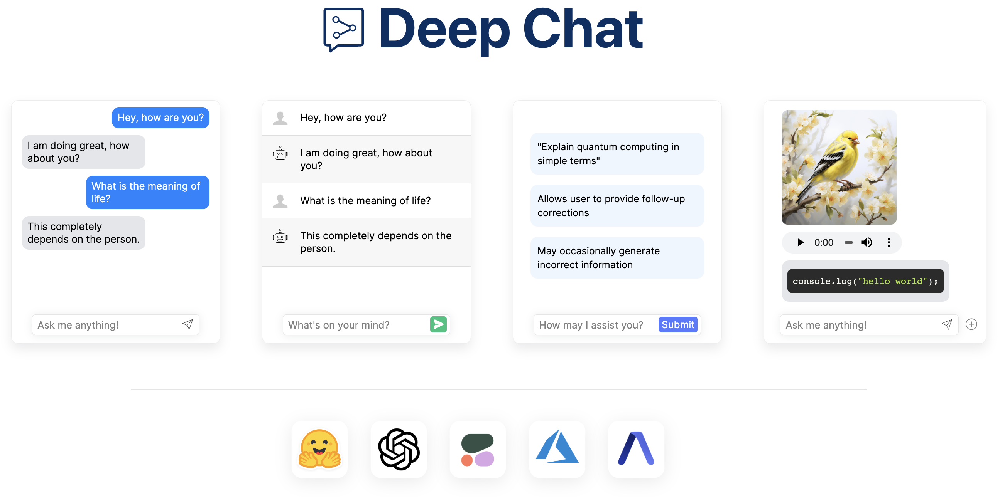
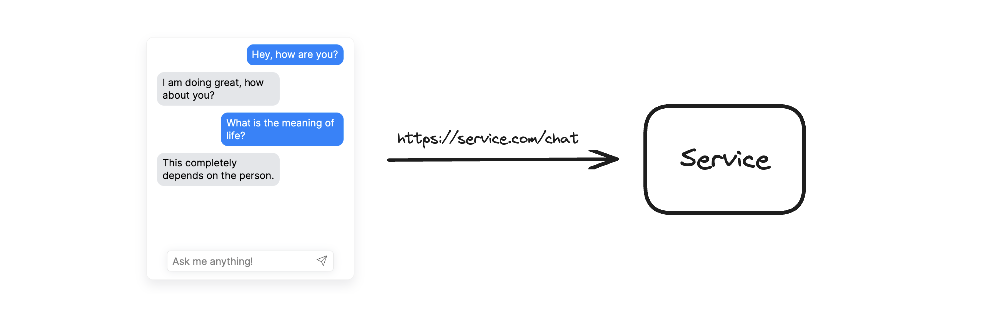

<br />



**Riverside Books Chatbot** is a simple, intelligent command-line FAQ chatbot for a fictional independent bookshop. It uses semantic search to match customer questions to the most relevant answer — even when the phrasing is completely different. Built in Python with zero external API dependencies.

### :rocket: Main Features

- **Semantic matching** — understands "when can I come in?" means opening hours, even with zero word overlap
- **Runs entirely locally** — no API keys, no network calls, no costs
- **Smart fallback** — politely declines when there's no good match instead of guessing
- **Interactive CLI** — ask questions in a loop until you type `quit` or `exit`
- **Clean, typed codebase** — dataclasses, type hints, and modular design
- **Comprehensive tests** — exact matches, paraphrases, edge cases, and no-match scenarios

### :computer: Getting started

```
pip install -r requirements.txt
```

Run the chatbot:

```
python src/chatbot.py
```

Run the tests:

```
pytest tests/ -v
```

### :zap: How it works



1. **On startup**, all 20 FAQ questions are embedded using `all-MiniLM-L6-v2` (a lightweight sentence transformer that runs locally).
2. **When you ask a question**, your query is embedded the same way.
3. **Cosine similarity** is computed between your query and every FAQ question.
4. **The best match** is returned — but only if the similarity score exceeds a tuned threshold.
5. **If nothing matches**, the bot responds: *"Sorry, I don't know that one — please ask a member of staff."*

### :electric_plug: Matching approach

We chose **local embeddings with `sentence-transformers`** over alternatives:

| Approach | Accuracy | Latency | Cost | Hallucination risk |
|----------|----------|---------|------|--------------------|
| **Embeddings (our choice)** | High for paraphrases | <100ms per query | Free | None |
| LLM (OpenAI) | Very high | 500ms–2s | Per-query cost | Possible |
| Keyword/fuzzy | Low for paraphrases | <1ms | Free | None |

**Why embeddings?** They capture semantic meaning — "when can I come in?" and "What are your opening hours?" share no words but have nearly identical embedding vectors. The model runs locally, so there's zero latency, zero cost, and zero hallucination risk. It's the pragmatic choice for a 20-FAQ bookshop bot.

### :robot: The model

We use [`all-MiniLM-L6-v2`](https://huggingface.co/sentence-transformers/all-MiniLM-L6-v2) via `sentence-transformers`:

- **384-dimensional** embeddings — compact and fast
- **~80MB** download once, then cached
- **Trained on 1B+ sentence pairs** — excellent at paraphrase detection
- **Runs on CPU** — no GPU required

### :beginner: Examples

Here's what a session looks like:

```
$ python src/chatbot.py

==================================================
  Welcome to Riverside Books!
  Ask me anything — type 'quit' or 'exit' to leave.
==================================================

You: when can I come in?
Bot: We're open 9am to 6pm Monday to Saturday, and 11am to 4pm on Sundays.

You: how do I get there?
Bot: We're at 42 Mill Lane, Riverside, RV1 2AB.

You: do you wrap presents?
Bot: Yes, we offer free gift wrapping on all purchases — just ask at the till.

You: what's the meaning of life?
Bot: Sorry, I don't know that one — please ask a member of staff.

You: quit
Bot: Goodbye! Thanks for visiting Riverside Books.
```

### :joystick: Test coverage

| Test category | What it verifies |
|---------------|------------------|
| Exact matches | Verbatim FAQ questions return correct answer with high confidence |
| Semantic paraphrases | "when can I come in?" → opening hours, "how do I get there?" → location |
| No-match fallback | Irrelevant questions return `None` (triggers fallback message) |
| Edge cases | Empty strings, very short queries, case insensitivity |

### :wrench: Tradeoffs & what I'd do with more time

**Current tradeoffs:**
- The embedding model (~80MB) downloads on first run — a few seconds of cold-start latency
- Very short queries ("parking?") have less semantic context and may score lower
- Negation isn't captured well by embeddings ("do you NOT have parking?" may still match)

**With more time, I would:**
1. **Add a hybrid fallback** — keyword overlap for short queries that embeddings miss
2. **Fine-tune the model** on bookshop-specific paraphrases for even better accuracy
3. **Build a simple Next.js + Tailwind frontend** (matching the team's stack) so customers can use it on the website
4. **Cache embeddings to disk** to eliminate cold-start latency entirely
5. **Add a confidence display** so users see how sure the bot is about each answer

## :tv: Demo

<p align="center">
    
</p>

## :heart: Contributions

Open source is built by the community for the community. If you have suggestions for improvements, ideas on how to take the project further, or have discovered a bug, do not hesitate to create a new issue ticket and we will look into it as soon as possible!
