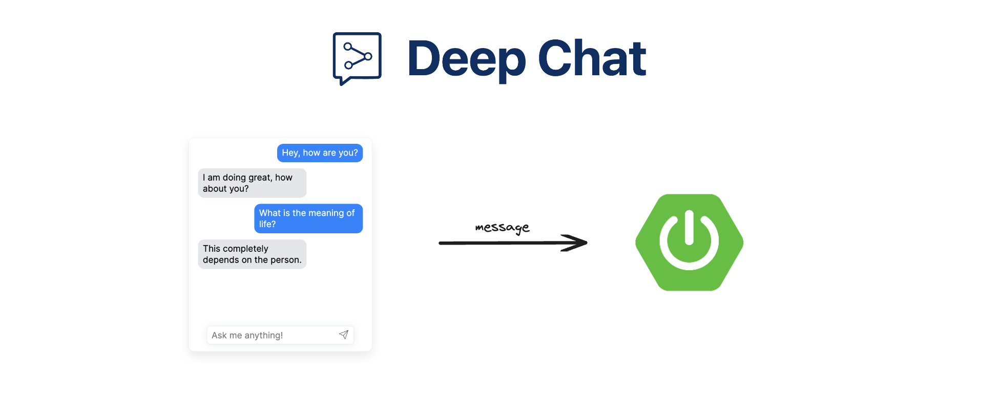

This is an example Spring Boot server template that can be used to communicate with the [Deep Chat](https://www.npmjs.com/package/deep-chat) component. It includes a variety of endpoints that can be used to host your own service or act as a proxy for the following AI APIs - [OpenAI](https://openai.com/blog/openai-api), [HuggingFace](https://huggingface.co/docs/api-inference/index), [StabilityAI](https://stability.ai/), [Cohere](https://docs.cohere.com/docs).

### :calling: UI component

This project is preconfigured to work with the example [UI project](https://github.com/OvidijusParsiunas/deep-chat/tree/main/example-servers/ui). Once both are running - they should be able to communicate with each other right out of the box.

### :computer: Local setup

```
git clone --depth 1 https://github.com/OvidijusParsiunas/deep-chat.git
```

Navigate to this directory and run the project using your preferred IDE (IntelliJ, Eclipse, etc.) or via the command line with Maven/Gradle.

### :wrench: Improvements

If you are experiencing issues with this project or have suggestions on how to improve it, do not hesitate to create a new ticket in [Github issues](https://github.com/OvidijusParsiunas/deep-chat/issues) and we will look into it as soon as possible.
